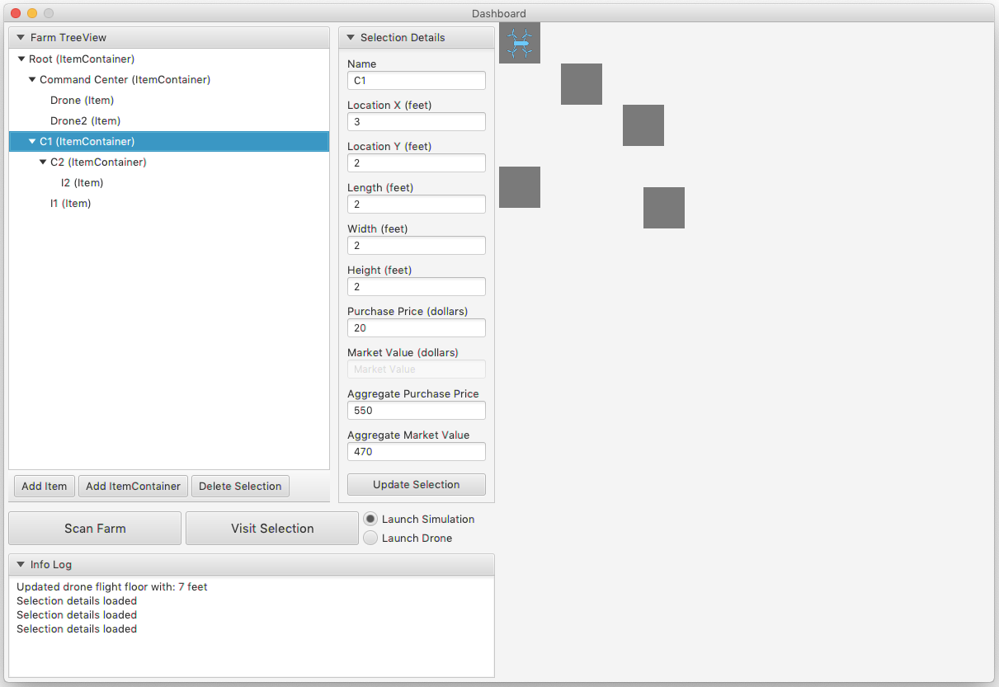

# Farm Dashboard Prototype

I initially developed this program as a team leader for a final project in a software engineering course taught by [Dr. Ramaraju Rudraraju](https://www.linkedin.com/in/ramarajur/) at [UAB](https://www.uab.edu/) with the help of Tahseen Robbani, Wesley Hataway, Daniel Swinney, and Hardik Patel.

This program is a prototype for a farmer utility application built with [JavaFX](https://docs.oracle.com/javase/8/javase-clienttechnologies.htm) as an exercise in using design patterns such as [composite](https://en.wikipedia.org/wiki/Composite_pattern), [visitor](https://en.wikipedia.org/wiki/Visitor_pattern), and [adapter](https://en.wikipedia.org/wiki/Adapter_pattern).



## Classes

### Entity Classes

- **ItemComponent** class (composite, pro-transparency)
  - **Item** class
  - **ItemContainer** class
- **ItemComponentVisitor** class
  - **AggregatePurchasePriceVisitor** class
  - **AggregateMarketValueVisitor** class
- **AnimatedDroneInterface** class
  - **AnimatedDrone** class
  - **TelloDroneAdapter** class (adapts **TelloDrone** to **AnimatedDrone**)
- **TelloDrone** class (provided by Seth)

### Boundary Classes

- **Dashboard** class (main)

### Control Classes

- **DashboardController** class

### Class Diagram


## Features

### Farm Items Tree View

### Farm Map

### Drone Animation

### Automatic Save/Load

#### Description

I implemented a bonus feature that does the following things:

- automatically saves the root `ItemContainer` of the `Dashboard` every time a component is added, updated, or deleted
- automatically loads the previous saved root `ItemContainer` when the `Dashboard` is re-opened

This feature allows the `Dashboard` to "remember" its previous state so that the user does not have to recreate all of the desired farm items each time they run the application.

#### Implementation

To implement this feature, I added static methods in the `ItemContainer` class for saving and loading `ItemContainer` objects via JSON serialization and deserialization.

```java
public static void saveJSON(ItemContainer itemContainer, String filePath);
```

I used the `saveJSON` method in the `DashboardController` class to save the root `ItemContainer` as a JSON string in a file named `rootItemContainer.json` whenever changes were made by the user.

```java
public static ItemContainer loadJSON(String filePath);
```

I used the `loadJSON` method in the `DashboardController` class to load the previous root `ItemContainer` (saved as a JSON string in `rootItemContainer.json` by `saveJSON`) whenever the `Dashboard` and `DashboardController` objects are initialized (which is whenever the application starts).

In both `saveJSON` and `loadJSON`, I leveraged the power of [the Gson library](https://github.com/google/gson) to serialize and deserialize `ItemComponent` objects to/from JSON. `Gson` is a popular tool used for Java object-JSON serialization and deserialization, and I found it easy to use, especially with the help of its excellent documentation.

Also, I added the required `Gson` jars as dependencies in the project so that there would be no need to import `Gson` manually when building and running the project.

## How To Run

(assuming you have **Eclipse IDE** and **Java JDK 8** installed)

- go to [https://gitlab.cs.uab.edu/420/project2](https://gitlab.cs.uab.edu/420/project2)
- clone this repository into `project2`
- open **Eclipse**
- select **File** -> **Import** -> **Existing Projects into Workspace** -> **Next** -> **Browse**
- locate the cloned `project2` directory in the filesystem dialogue and select to open it
- select **Finish**
- click the green play button labeled "Run" on the upper icon bar
